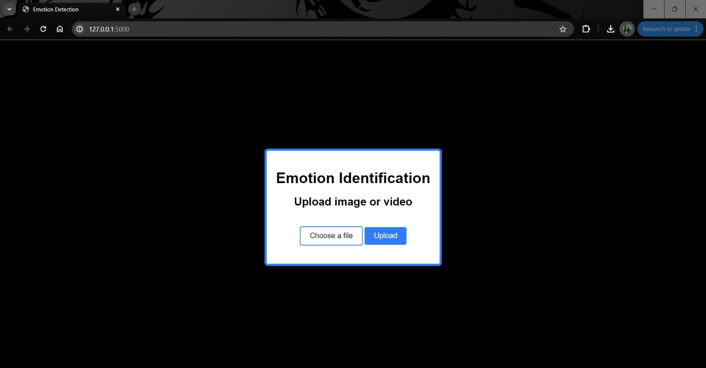

# FER May Hakathon

Facial Emotion Detection Hackathon Project, Create a model and test it uing 5 to 10 sec videos to detect emotions 

# Syntax Squad
Team Leader: Zafar Shaikh  
Team Members: Amaal Mecci, Saif Faisal  
Email ID: shzafar110@gmail.com  

Objective: Develop an efficient facial emotion classification system employing OpenCV/Tensorflow to identify facial emotions within video streams. The goal is to achieve a high level of accuracy, low latency, and minimal computational overhead.

Instructions of using our FLASK app:
1. Install Flask using the pip command
2. Ensure that OpenCV libraries are installed (using the pip command)
3. Run the main.py file
4. When the main file is running, it will show your webserver IP URL on the terminal.
5. Copy paste the URL onto any web browser and the Flask app should run.

Demo:

Here is our FLASK app made using Python Flask libraries:

The Flask app can process both images and videos through the same app

Image Processing:

Here we will upload an image to process and detect the emotion from:

The uploaded image shows us the emotion detected with the help of our FER Model:

Video Processing:

Here will upload a video to process and detect the faces frame by frame

The uploaded video show us the emotion being detected frame by frame using the FER Model:

